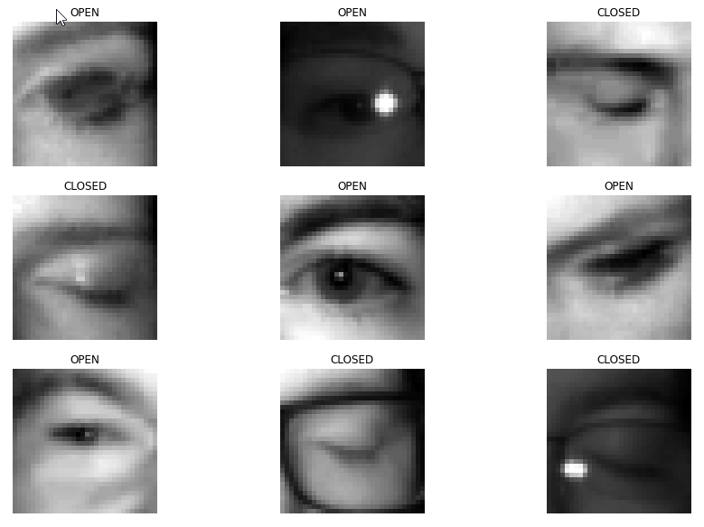

# Task
Classify image of eye as closed or open. (MRL Dataset)

# Dataset 
MRL Eye Dataset is a large-scale dataset of human eye images. The images are annotated according to the state of the eye (open or closed), presence of glasses, reflections etc. 

# Approaches

**Part 1** - Contains notebooks for data exploration, cleaning and for converting the data into a dataframe

**Part 2** - Contains notebooks of the different approaches I tried. 

* Random forest model
* Neural network with fully connected layers
* Neural network with convolutional layers.
* Auto encoder

**Part 3** - Explainable AI
- [ ] GradCam
- [ ] GradCam++
- [ ] ScoreCam

# Results

